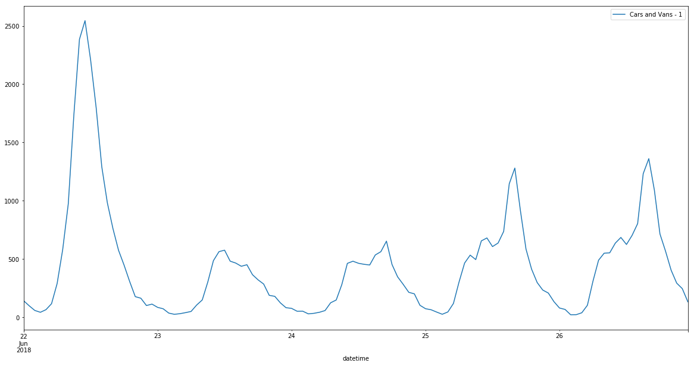
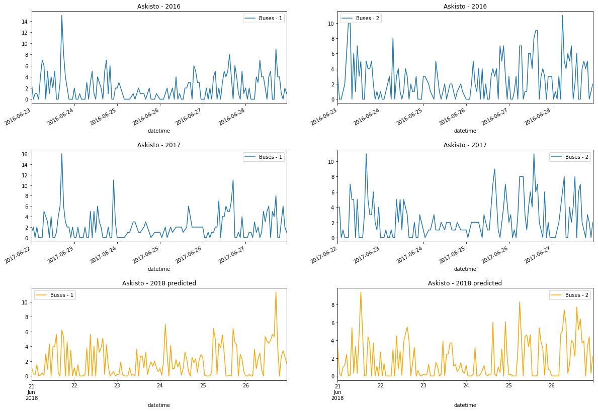

# BCG Gamma Data Science Competition 2018
This project includes a solution to BCG's data science competition in Summer 2018.

## About
The competition is based on Finnish Transport Agency's open road traffic data
(https://www.liikennevirasto.fi/web/en/open-data/). The data includes vehicle type specific traffic volumes 
at Automatic traffic measurement stations (TMS).

The assignment is to produce forecasting algorithm and a forecast of hourly
traffic volumes per vehicle category:
- Forecast period: 22.6.-26.6.2018
- Forecasts for three specified TMS locations: Askisto, Mäntsälä and Kemijärvi
- Solution submission DL: 21.6.2016

Full details of the assignment: [BCG Gamma Data Science Competition Document.pdf](https://github.com/KovaVeikko/bcg-gamma/blob/master/BCG%20Gamma%20Data%20Science%20Competition%20Document.pdf)

## Solution
All source code of the solution is included in Jupyter notebooks (.ipynb files):
- [1 Download Raw Data.ipynb](https://github.com/KovaVeikko/bcg-gamma/blob/master/1%20Download%20Raw%20Data.ipynb)
- [2 Refine Data.ipynb](https://github.com/KovaVeikko/bcg-gamma/blob/master/2%20Refine%20Data.ipynb)
- [3 Prediction.ipynb](https://github.com/KovaVeikko/bcg-gamma/blob/master/3%20Prediction.ipynb)
- [4 Visualization.ipynb](https://github.com/KovaVeikko/bcg-gamma/blob/master/4%20Visualization.ipynb)
- [5 User Interface.ipynb](https://github.com/KovaVeikko/bcg-gamma/blob/master/5%20User%20Interface.ipynb)

Simplified source code of the model is included in submission/ directory as 
[model.py](https://github.com/KovaVeikko/bcg-gamma/blob/master/submission/model.py)

### Data
#### Historical TMS Data
Historical TMS data, or historical volumes, is provided in Excel workbooks: 
one workbook for each month and TMS station. The raw TMS data includes the following columns: 
- TMS station id 
- TMS Station name
- Date
- Direction (1 or 2)
- Vehicle type (7 different types)
- Volume for each hour 0-1, 1-2...

This data is available from 1/2010 to 5/2018.

#### Other Data Sources
It was encouraged by the competition organizers to apply additional data sources,
such as weather data. In fact, I did try to incorporate weather data from Finnish Meteorological 
Institute (http://ilmatieteenlaitos.fi/avoin-data-avattavat-aineistot) including 
daily rain and temperature statistics. However, it turned out that the weather data did
not improve the prediction performance, which is why I decided not to use it in the final solution.

### Methodology
#### Acquiring Data
First I had to decide what data to use for training. Obviously it would have been ideal to start with 
as much as possible historical data from all possible TMSs. However, as the data has been stored in
separate workbooks per each month and each location, I would have needed to download thousands of
Excel files. Thus, I decided to limit the training data to those three stations that I needed to
forecast volumes for: Askisto, Mäntsälä and Kemijärvi. To downloads these files, I wrote a script that
loops through each month from 2010 to 2017 and generates urls for the files.

Once the raw data was downloaded, I converted the xls files to csv format and combined them into a 
single csv file "raw_dataset.csv".

Finally, I improved the raw data by renaming the columns and adding calculated features
'week of year' and 'weekday'. 

#### Prediction Model
As the forecasting problem is a time series kind, i.e. having seasonality and trend components, 
a natural approach would be to use time series methods, such as ARMA or ARIMA. On the other hand,
in this era of deep learning, I considered trying Recurrent Neural Network (RNN) which would
be good at modelling complicated long-term relationships between the inputs.

However, before diving into the neural networks, I decided to try a more simple yet sophisticated approach: 
Random Forest Regression (RF). My motivation was that the underlying forecasting problem involves various
components that cause regular variations, such as public holidays, weekends, rush hours and seasons.
Specifically, as we are interested in period 22.6. - 26.6.2018 which happens to include the Midsummer's
Eve, we need to pay special attention to these variations. Furthermore, RF is significantly simpler
than RNN in terms of computing efficiency and hyper parameter tuning.

I used RandomForestRegressor from scikit-learn python library. The model turned out to perform very well, 
so I stayed with it. In fact, the score (mean accuracy) on the test data was 0.97  right away without 
further tuning, so I used the default settings. 

#### Testing
In order to test performance of the model, I divided the TMS data into training and test sets with
80/20 split. This resulted in 85936 observations for training and 21484 for testing.
The test data was selected randomly and it was not used for training the model.

The performance was measured using R^2 = (1 - u/v), where u is the regression
sum of squares sum((y_true - y_pred)^2) and v is the residual
sum of squares sum((y_true - mean(y_true))^2). The best possible score is 1.0.

The score on the test data was 0.97 which is very good. Additionally, as the objective was
to produce forecasts for Thu 22.6. - Tue 26.6., I tested the model on the corresponding dates
last year (from week 25 Thu to week 26 Tue). This score was 0.997, thus being nearly perfect.
However, the latter score is vulnerable to high variance (overfitting), as there is a good 
chance that this test data was used for training. The high score suggests however that the 
model recognizes special dates, such as the Midsummer's Eve.

As there was no need for tuning hyper parameters, a cross-validation set was not incorporated. 

### Results
Using the trained model, I generated prediction time series for year 2018 and saved as 
[prediction_ts.csv](https://github.com/KovaVeikko/bcg-gamma/blob/master/prediction_ts.csv).
This data can be used to view predictions with different parameters. I have made a 
[notebook](https://github.com/KovaVeikko/bcg-gamma/blob/master/5%20User%20Interface.ipynb)
for selecting the forecast and plotting it.

The predictions for the actual target period 22.6. - 26.6.2018 is saved as 
[prediction_22062018_26062018.csv](https://github.com/KovaVeikko/bcg-gamma/blob/master/submission/prediction_22062018_26062018.csv).

As examples, below is attached a couple of graphs of the forecast period.
Figure 1 visualizes the predicted volumes of cars and vans to direction 1 in Mäntsälä.
Figure 2 in turn shows comparison of predicted and realized volumes of buses in Askisto
between 2018 and 2016 + 2017.

  <label>Figure 1 Predicted volumes of cars and vans in Mäntsälä</label>
  

  <label>Figure 2 Comparison between realized and predicted volumes of buses in Askisto</label>
  

### Generalizability
As the model has been trained with 10 years of hourly data from three TMS, the model
generalizes well to these locations (Askisto, Mäntsälä, Kemijärvi). That is, the model
can be used for predicting hourly volumes of any vehicle type over any future period
as long as the location is one of the three.

To extend the model to produce meaningful predictions to other locations, one has to
retrain the model so that TMS data from the desired locations is included.

